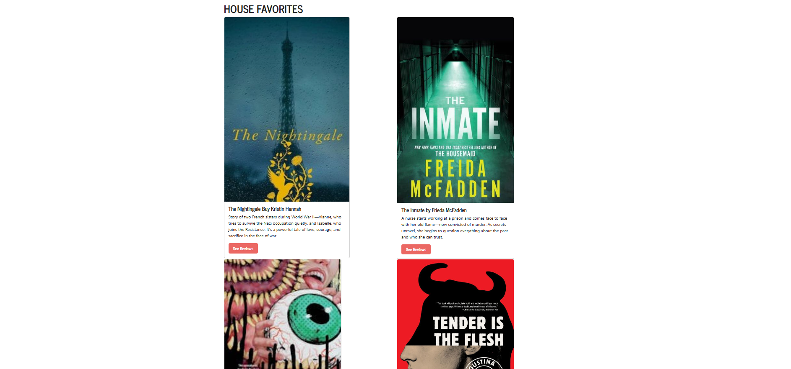
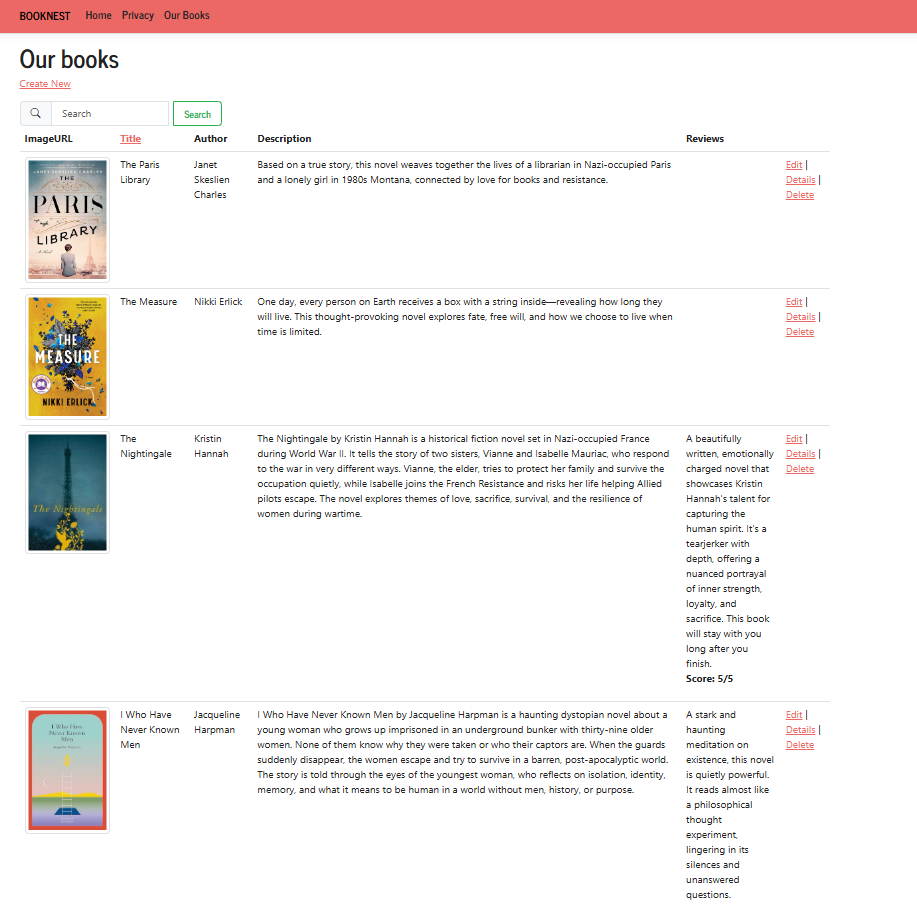
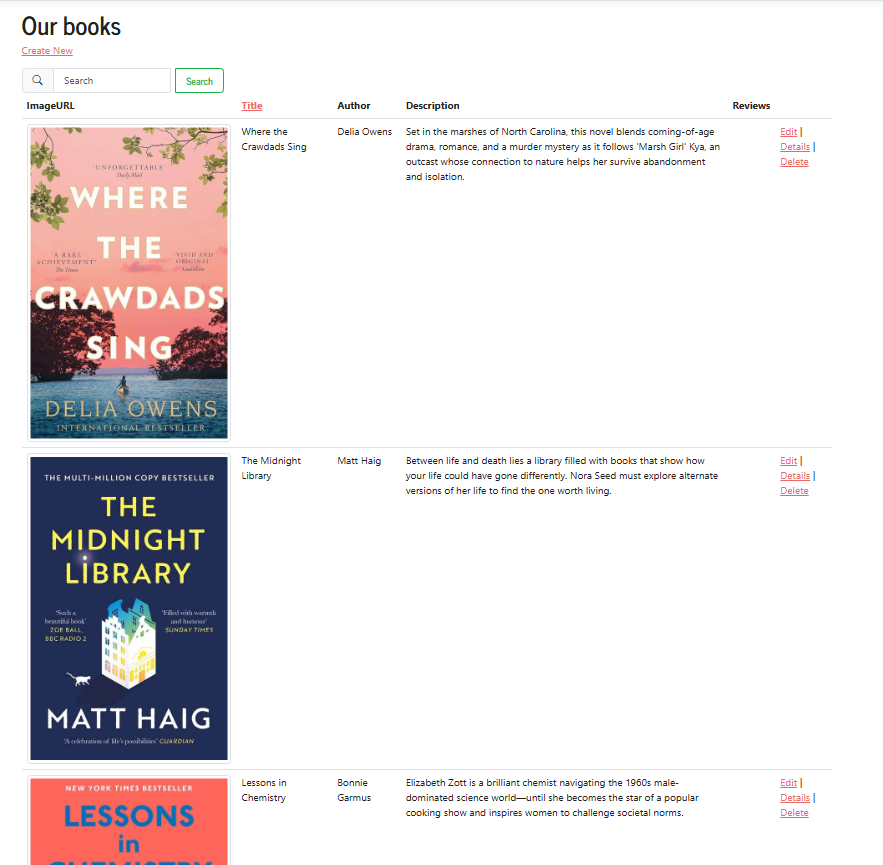

# BookNest

I have created a website with a custom navigation bar that allows people to see a limited collection of books descriptions, authors, and reviews for each.

Above is a preview of the homepage to the website. I have several navigation tabs that take you to the pages to view books. There is also a few books listed on the home page for the top recommendations. When you click "See Review" it takes you to the review page where you can see a list of reviews for each book.

When you click "Our Books" at the top, it shows you a list of all the books with descriptions and the authors.

